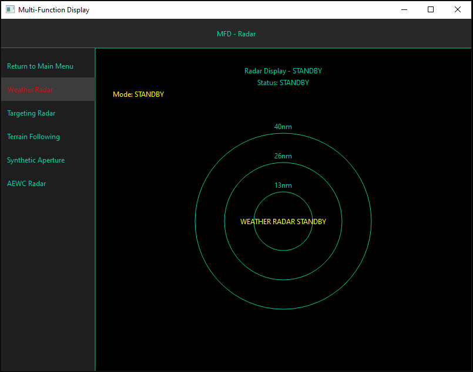

# FMOFP — Flight Management Operating Flight Program

[](https://github.com/TubAleeLo/fmofp/actions/workflows/ci.yml)

A Python/PyQt6 **avionics simulation system** for the fictional B20SS military
aircraft: five radar processors, three display families, a software
MIL-STD-1553B bus simulation, flight management and flight control systems,
and ~25 aircraft subsystems, integrated through an event-driven
async/threading architecture with SQLite persistence.



## What's inside

- **Radars** — Weather (VIL, precipitation analysis, storm-cell tracking,
  wind shear, turbulence), Targeting, SAR, TFR (terrain following), and AEWC,
  plus a cross-radar data-fusion layer.
- **Displays** — PFD, MFD, and Holographic families, plus EICAS, TSD, SMS,
  and per-radar displays, driven by a node state-tree, theme layer, and a
  Gaussian-kernel rendering engine.
- **MIL-STD-1553B** — software Bus Controller + Remote Terminal over local
  sockets, with full word-type encode/decode and error injection.
- **Systems** — FMS, FCS, navigation (INS/GPS), engine/fuel/thrust,
  hydraulics, electrical power, ECS, defensive systems (RWR, chaff/flare,
  ECM), sensor management, mission planning, built-in test, and more.
- **Scenario engine** — XML-scripted training and failure scenarios.

## Requirements

- Python 3.10+ (CI covers 3.10 – 3.14)
- Windows 10/11 64-bit is the primary target (PyQt6 wheels for offline
  install are bundled under `B20SS/PyQt6/`); Linux and macOS work via a
  normal PyPI install.
- Dependencies: PyQt6 6.8.1, NumPy, SciPy, qasync, click — see
  `B20SS/requirements.txt` (the single source of truth that CI and the
  installer both read).

## Quick start

```bash
git clone https://github.com/TubAleeLo/fmofp.git
cd fmofp/B20SS

# Option A: automated installer (recommended; supports offline installs)
python install.py

# Option B: plain pip
pip install -r requirements.txt

# Run the simulation
python FMOFP/Main.py
```

Configuration lives in the XML files next to `Main.py`
(`startupConfiguration.xml`, `dbConfig.xml`, `rtAddressConfig.xml`,
`messageRateConfig.xml`, `queryRateConfig.xml`).

## Running the tests

```bash
cd B20SS
# Entire standalone-safe suite (what CI runs), one exit code:
python FMOFP/Tests/run_all_tests.py

# Boot smoke test alone (verifies the real entry path can start):
python FMOFP/Tests/ci_test_boot_smoke.py
```

On a headless machine, set `QT_QPA_PLATFORM=offscreen` (the runner sets it
for you). Some test files are excluded from the runner by design — they
require the live system's debug-CLI harness or an interactive GUI; the
runner's docstring lists them and why.

## Repository layout

| Path | Contents |
|---|---|
| `B20SS/FMOFP/` | The application: `Main.py` entry point, `core/`, `Systems/`, `MIL_STD_1553B/`, `Interfaces/` (displays, messaging, scenarios), `local_messaging/`, `storage/`, `Utils/`, `Tests/` |
| `B20SS/PLANNING.md` | Architecture, per-subsystem status, known-issues ledger, audit history |
| `B20SS/FMOFP_User_Manual/` | 14-chapter user manual |
| `B20SS/FMOFP/docs/` | Display/messaging architecture, requirements, and coding-standards docs |
| `B20SS/__Diagrams__/`, `B20SS/__ABOUT__/` | UML/block/sequence/state diagrams, screenshots, demo videos |
| `B20SS/install.py` | Cross-platform automated installer |
| `.github/workflows/ci.yml`, `bitbucket-pipelines.yml` | CI (kept in sync — edit both) |

## Documentation

Start with [`B20SS/PLANNING.md`](B20SS/PLANNING.md) for architecture and
current status, and the [user manual](B20SS/FMOFP_User_Manual/00_Title_and_TOC.md)
for operating the simulated systems. Feature status markers in the manual
(✅ / ⚠️ / ❌) reflect implementation state.

## Status

Actively developed simulation project. All five radars, the display stack,
the 1553B bus, and the wired-in subsystems are operational; remaining gaps
are tracked in `PLANNING.md` §14 ("Current Status Summary") and §15
("Next Steps"). This is a simulation for education/portfolio purposes — it
is **not** certified avionics software and must not be used for real flight
operations.

## License

Proprietary — all rights reserved. See [LICENSE](LICENSE) and the manual's
[legal information chapter](B20SS/FMOFP_User_Manual/00b_Legal_Information.md).
